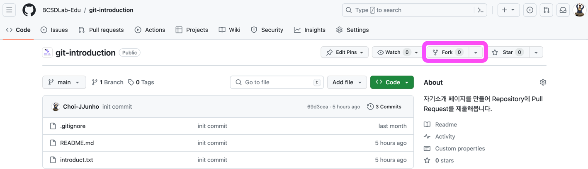
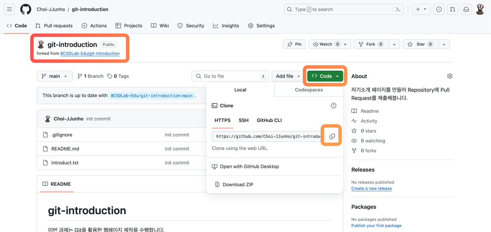

# git-introduction

이번 과제는 Git에 익숙해지기 위한 과정을 거쳐봅니다.
주어진 요구사항에 맞게 과제를 제출해주세요!

## 요구사항

* 레포지토리를 fork하여 자신의 저장소에서 작업을 수행합니다.
* fork한 레포지토리를 clone 하여 `introduction.txt` 파일에 본인의 자기소개 문구를 채워넣습니다.
* 각 항목별로 커밋을 수행합니다.
* 커밋 메시지를 다음과 같이 작성합니다.
  * `feat: 학번 작성`
  * `feat: 이름 작성`
  * `feat: 지원 트랙 내용 작성`
  * `feat: 취미 작성`
* Pull Request를 작성합니다.

## Hint

### Git Fork



https://github.com/BCSDLab-Edu/git-introduction

위 레포지토리에 들어가서 Fork를 수행합니다.

### Git Clone



```git
git clone https://github.com/{본인이 fork한 레포지토리 주소}
```

본 문서는 자신의 학번, 이름, 지원트랙, 취미를 작성하는 텍스트 파일에 대한 파일입니다.

각각의 정보를 자신의 정보에 맞게 적절히 수정하여 Pull Request를 제출해보세요!

### 명령어

과제 수행 간 다음과 같은 명령어를 활용할 수 있습니다.

```shell
# 변경 사항을 스테이지에 올립니다.
git add .

# 스테이지에 올라온 변경사항을 커밋합니다.
git commit -m "커밋메시지"

# 커밋 내역을 원격 저장소에 push합니다.
git push origin main
```
